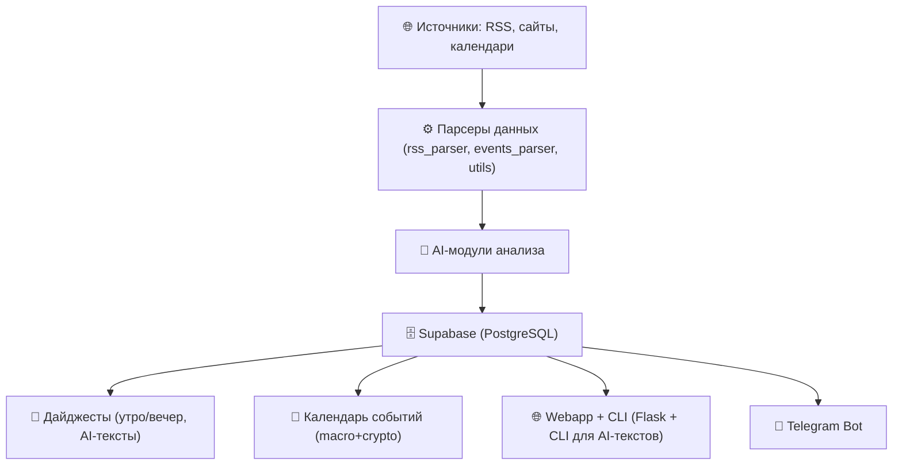

# PulseAI


**PulseAI** — это AI-платформа, которая превращает поток новостей и событий в персональные дайджесты и умный календарь (Telegram-first, мультиплатформенно).

## Table of Contents

- [Features](#features)
- [Project Structure](#project-structure)
- [Quick Start](#quick-start)
- [Installation](#installation)
- [Usage](#usage)
- [Testing](#testing)
- [Telegram Bot](#telegram-bot)
- [Events](#events)
- [Digests](#digests)
- [Architecture](#architecture)
- [Roadmap](#roadmap)
- [Monetization](#monetization)
- [Status](#status)
- [Contacts](#contacts)

## Features

- 📰 **AI-аннотации новостей** — "что случилось" + "почему важно"
- 📅 **Умный календарь событий** — крипта, макроэкономика, технологии
- 🤖 **Telegram-бот** с подписками и категориями
- 📊 **Оценка достоверности и важности** — автоматическая AI-оценка
- 🌐 **Мультиплатформенность** — Telegram-first, с планами на Discord и web
- 🔄 **Персонализация** — подписки по категориям и интересам
- ⚡ **Real-time обновления** — мгновенные уведомления о важных событиях
- 🎯 **Умная фильтрация** — только релевантные новости для вас

## Project Structure

```text
├── ai_modules/        # AI-модули (credibility, importance)
├── config/            # настройки, константы, источники
├── database/          # работа с Supabase (db_models)
├── digests/           # генерация дайджестов (AI-summary, генератор)
├── docs/              # документация (ARCHITECTURE, ROADMAP, VISION, DEPLOY)
├── parsers/           # парсеры RSS и событий
├── repositories/      # репозитории для работы с данными
├── routes/            # Flask-маршруты
├── services/          # бизнес-логика сервисов
├── telegram_bot/      # Telegram bot на aiogram 3.x
├── tools/             # утилиты (fetch, show_news, фиксы)
├── tests/             # юнит- и интеграционные тесты
├── utils/             # вспомогательные утилиты
├── webapp.py          # Flask-приложение
└── main.py            # CLI-обработка новостей
```

## Quick Start

1. **Настройка окружения:**
   ```bash
   cp .env.example .env
   # Заполните обязательные переменные:
   # TELEGRAM_BOT_TOKEN=your_bot_token
   # SUPABASE_URL=your_supabase_url
   # SUPABASE_KEY=your_supabase_key
   # OPENAI_API_KEY=your_openai_key (опционально)
   ```

2. **Установка зависимостей:**
   ```bash
   pip install -r requirements.txt
   ```

3. **Запуск бота:**
   ```bash
   make run-bot
   ```

### Commands

- **Запуск бота:** `make run-bot`
- **Тесты:** `make test`
- **Линтер:** `make lint`
- **Форматирование:** `make format`
- **Тесты + бот:** `make run-tests-bot`

### Daily Digests

Автоматическая отправка дайджестов пользователям:
```bash
python tools/send_daily_digests.py
```

Проект тестируется через pytest и поддерживает async (pytest-asyncio).

## Installation

```bash
# Клонирование репозитория
git clone https://github.com/denius89/news_ai_bot.git
cd news_ai_bot

# Установка зависимостей
pip install -r requirements.txt

# Создание .env на основе примера
cp .env.example .env
# заполните SUPABASE_URL и SUPABASE_KEY
# (OPENAI_API_KEY, DEEPL_API_KEY — опционально, для будущих функций)
```

## Usage

### Quick Start

```bash
# Запуск бота
python -m telegram_bot.bot

# Запуск webapp
python webapp.py

# Генерация дайджеста вручную
python -m digests.generator --ai --category economy --style analytical
```

### Additional Commands

```bash
# Запуск сбора новостей (ETL)
python tools/fetch_and_store_news.py

# Просмотр последних новостей
python tools/show_news.py --limit 10

# CLI (пример: собрать 20 новостей из всех источников)
python main.py --source all --limit 20
```

## Testing

```bash
# Запуск тестов с подробным выводом
pytest -v --maxfail=1

# быстрые тесты без интеграции
pytest -m "not integration"

# интеграционные тесты (работа с БД и API)
pytest -m integration

# форматирование и проверка стиля
black .
flake8 .
```

## Telegram Bot

PulseAI доступен в Telegram! Бот реализован на **aiogram 3.x**, поддерживает inline-кнопки и навигацию.

### Commands

- `/start` — приветствие + кнопка «🚀 Старт»
- `/digest` — последние важные новости (с метриками Credibility/Importance)
- `/digest_ai` — выбор категории и генерация AI-дайджеста за день
- `/events` — ближайшие события из экономического календаря

### Navigation

- Главное меню: 📰 Новости, 🤖 AI-дайджест, 📅 События
- Внутри разделов доступна кнопка ⬅️ «Назад» для возврата
- AI-дайджест поддерживает выбор категории (Crypto, Economy, World, Technology, Politics)

### Setup

```bash
export TELEGRAM_BOT_TOKEN="your-bot-token"
python -m telegram_bot.bot
```

Требуется переменная окружения `TELEGRAM_BOT_TOKEN` в `.env`.

### Example Workflow

1. `/start` → кнопка «🚀 Старт»
2. Главное меню → выбираем «🤖 AI-дайджест»
3. Выбор категории → «📊 Crypto»
4. Получаем AI-дайджест за сегодня + кнопку «⬅️ Назад»

## Events

PulseAI умеет собирать и хранить экономические и крипто-события (например, решения ФРС, релизы CPI, хардфорки блокчейнов).

- Источник: Investing.com (экономический календарь)
- Поля: `event_time`, `country`, `currency`, `title`, `importance (1–3)`, `fact`, `forecast`, `previous`, `source`
- В БД события сохраняются в таблицу `events` с уникальным `event_id`
- В UI события отображаются в виде таблицы (desktop) и карточек (mobile), с бейджами важности

```bash
python -m tools.fetch_and_store_events
```

## Digests

Можно собрать дайджест новостей прямо из базы.

### Regular Digest

```bash
python main.py --digest 5
```

### AI Digest

```bash
python main.py --digest 5 --ai
```

### Parameters

- `--digest N` — количество последних новостей для дайджеста
- `--ai` — включить генерацию текста с помощью AI

## Architecture



### Tech Stack

- 🐍 **Python 3.11+**
- 🤖 **OpenAI API** — оценка достоверности и аналитика
- 🌍 **DeepL API** — переводы
- 🗄️ **Supabase (PostgreSQL + API)** — хранилище данных
- 🚀 **Render** — деплой webapp и фоновые задания (ETL)
- 🌐 **Flask** — web-интерфейс
- ✅ **Pytest** — тестирование и CI
- 🤖 **aiogram 3.x** — Telegram bot

## Roadmap

Подробный план развития проекта доступен в [docs/ROADMAP.md](docs/ROADMAP.md).

### ✅ Completed (Week 1-2: Day 1-9)

- Настроено окружение и репозиторий
- Подключены **OpenAI**, **DeepL** и **Supabase**
- Реализован **парсинг RSS** и сохранение новостей в базу
- Настроено централизованное **логирование**
- Добавлены базовые **тесты** (`pytest`)
- Подготовлен **MASTER_FILE.md** (структура, история решений)
- Настроены **git hooks** для `CODEMAP.md` и `TASKS.md`
- Реализован модуль **дайджестов** (CLI-флаг `--digest`, AI-генерация текста)
- Добавлен **Telegram bot** с полной навигацией
- Реализован парсинг **экономических событий**
- Добавлена **webapp** для просмотра новостей и событий
- Рефакторинг на **Pydantic модели** и централизованные сервисы
- **Система управления процессами** — автоматический запуск бота и WebApp
- **Стабилизация системы** — исправлены все проблемы с портами и тестами

### 🔜 Next Steps (Week 3)

- 🚀 **Продакшн деплой** — развертывание на Render/Heroku
- 📊 **Мониторинг** — система отслеживания производительности
- 🗂 Добавление **фильтра по темам**
- 📅 Поддержка **календаря событий** с приоритетами
- 🌐 Добавление новых источников (crypto + economy)
- 📱 **Мобильное приложение** — расширение на iOS/Android

### 🚀 Future (Month+)

- 📰 White-label интеграции для медиа
- ⏰ Автоматические дайджесты (утро/вечер)
- ⚙️ CI через GitHub Actions (полный прогон тестов + форматирование)
- 📊 Улучшенные **AI-аналитические отчёты**

## Troubleshooting

### Common Issues

#### "Message is not modified" error
```
TelegramBadRequest: message is not modified
```
**Solution:** This is handled automatically in the bot handlers. The error occurs when trying to edit a message with identical content.

#### Database duplicate key error
```
duplicate key value violates unique constraint "notifications_user_id_type_key"
```
**Solution:** Fixed in `database/db_models.py` with proper `on_conflict` handling in `upsert_notification`.

#### Make command not found
```
make: python: No such file or directory
```
**Solution:** Ensure virtual environment is activated and use `make run-bot` or `python3 -m telegram_bot.bot` directly.

#### Tests failing with async errors
```
RuntimeError: asyncio.run() cannot be called from a running event loop
```
**Solution:** Tests are configured with `pytest-asyncio` in `auto` mode. Use `make test` or `python -m pytest`.

## Monetization

Возможные модели монетизации проекта:

1. **Подписка SaaS (B2C)**
   - Базовый доступ к новостям и дайджестам бесплатный
   - Расширенный тариф: AI-анализ, персонализация, сохранённые фильтры, дополнительные источники

2. **B2B API**
   - Доступ к API новостей и событий с AI-оценкой достоверности и важности
   - Тарифы по количеству запросов (news as a service)

3. **White-label решения**
   - Готовые виджеты/фиды для медиа, брокеров, финтеха
   - Возможность интеграции под бренд клиента

4. **Telegram-бот (Freemium)**
   - Бесплатный базовый бот: новости и дайджесты
   - Премиум-подписка: персонализация, AI-аналитика, календарь событий, интеграция с другими платформами

5. **Партнёрские интеграции**
   - Встраивание в финтех/криптосервисы (например, трейдинг-приложения)
   - Revenue share или referral-модель

## Status

MVP в активной разработке. Фокус — минимальные затраты и рабочий прототип.

## Contacts

Автор: [@denius89](https://github.com/denius89)  
Лицензия: [MIT](https://github.com/denius89/news_ai_bot/blob/main/LICENSE)