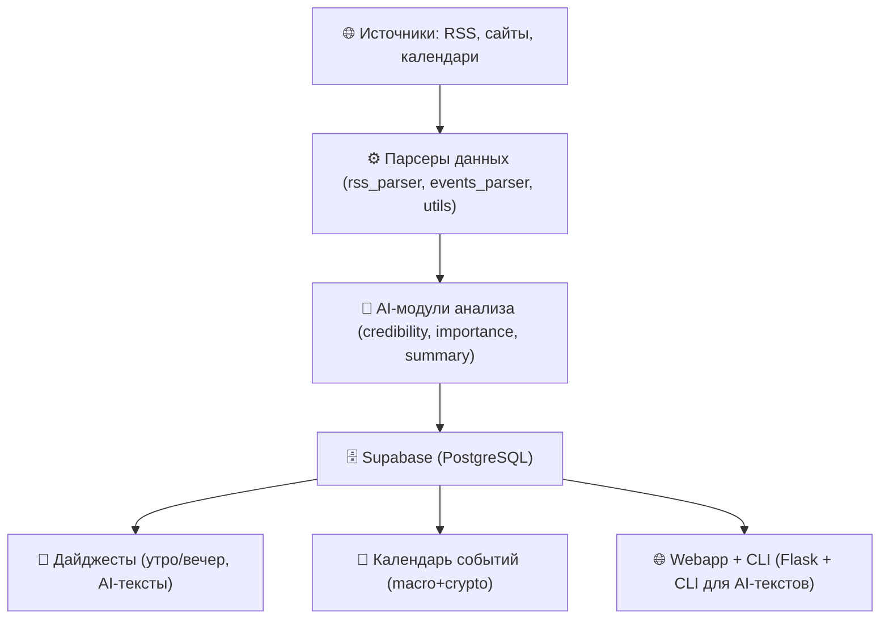

# 🏗 Архитектура проекта

PulseAI построен как ETL-пайплайн с AI-анализом и выводом в разные интерфейсы.

## Визуальная схема

## Основные компоненты

- **Источники** — RSS-ленты, экономические календари, новостные сайты.  
- **Парсеры** — модули для извлечения и очистки данных (`parsers/rss_parser.py`, `parsers/events_parser.py`, `utils/clean_text.py`).  
- **AI-модули** — анализ достоверности, важности, генерация аннотаций.  
- **Хранилище** — Supabase (PostgreSQL) с таблицами `news` и `events`.  
- **Вывод** — дайджесты, календарь событий, webapp и CLI-интерфейсы.  

---

📌 Документ обновлён на Day 2 — схема и описание совпадают с README.
