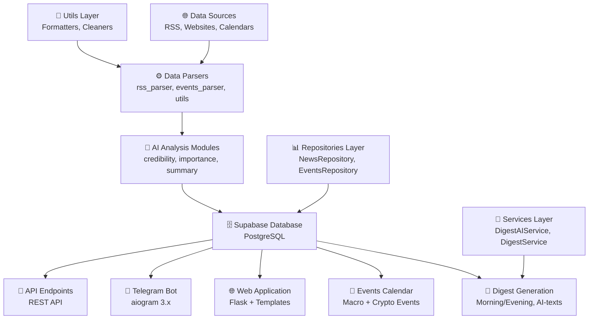

# PulseAI System Architecture

PulseAI is built as an ETL pipeline with AI analysis and output to different interfaces.

## Table of Contents

- [System Overview](#system-overview)
- [Architecture Diagram](#architecture-diagram)
- [Core Components](#core-components)
- [Data Flow](#data-flow)
- [Technology Stack](#technology-stack)
- [Database Schema](#database-schema)
- [API Design](#api-design)
- [Deployment Architecture](#deployment-architecture)

## System Overview

PulseAI transforms chaotic news and events streams into structured, AI-analyzed content delivered through multiple interfaces including web applications, Telegram bots, and APIs.

## Architecture Diagram



## Core Components

### Data Sources
- **RSS Feeds** — News from crypto, economy, world, tech categories
- **Economic Calendars** — Investing.com events parsing
- **News Websites** — Direct scraping capabilities

### Data Processing Layer
- **Parsers** — Data extraction and cleaning modules
  - `parsers/rss_parser.py` — RSS feed processing
  - `parsers/events_parser.py` — Economic events parsing
  - `utils/clean_text.py` — HTML cleaning and text normalization
- **AI Modules** — Content analysis and scoring
  - `ai_modules/credibility.py` — News credibility assessment
  - `ai_modules/importance.py` — News importance scoring
  - `digests/ai_summary.py` — AI-powered digest generation

### Data Storage
- **Supabase (PostgreSQL)** — Primary database
  - `news` table — News articles with AI scores
  - `events` table — Economic events with priorities
  - `users` table — User management (future)
  - `subscriptions` table — User preferences (future)

### Business Logic Layer
- **Services** — Core business logic
  - `services/digest_service.py` — Digest generation
  - `services/digest_ai_service.py` — AI-powered digest service
- **Repositories** — Data access layer
  - `repositories/news_repository.py` — News data operations
  - `repositories/events_repository.py` — Events data operations

### Presentation Layer
- **Web Application** — Flask-based web interface
  - Templates for news, events, and digests
  - Responsive design with mobile support
- **Telegram Bot** — aiogram 3.x based bot
  - Inline navigation and commands
  - AI digest generation by categories
- **CLI Interface** — Command-line tools
  - `main.py` — Main CLI application
  - `tools/` — Utility scripts

## Data Flow Diagram

```mermaid
flowchart LR
    A["📥 Data Sources<br/>RSS, Websites, Calendars"] --> B["⚙️ Parsers<br/>rss_parser.py<br/>events_parser.py"]
    B --> C["🧹 Data Cleaning<br/>clean_text.py<br/>deduplication"]
    C --> D["🗄️ Database<br/>Supabase PostgreSQL<br/>news, events tables"]
    D --> E["🤖 AI Modules<br/>credibility.py<br/>importance.py<br/>ai_summary.py"]
    E --> F["📊 Repositories<br/>news_repository.py<br/>events_repository.py"]
    F --> G["🔧 Services<br/>digest_service.py<br/>digest_ai_service.py"]
    G --> H["📤 Output<br/>Telegram Bot<br/>Web App<br/>API"]
    
    style A fill:#e1f5fe
    style B fill:#f3e5f5
    style C fill:#e8f5e8
    style D fill:#fff3e0
    style E fill:#fce4ec
    style F fill:#e0f2f1
    style G fill:#f1f8e9
    style H fill:#e3f2fd
```



## Technology Stack

### Backend
- **Python 3.11+** — Main programming language
- **Flask** — Web framework
- **Supabase** — Database and authentication
- **OpenAI API** — AI analysis and content generation
- **aiogram 3.x** — Telegram bot framework

### Data Processing
- **Requests** — HTTP client for data fetching
- **Feedparser** — RSS feed parsing
- **BeautifulSoup** — HTML parsing and cleaning
- **Pydantic** — Data validation and models

### Development Tools
- **Pytest** — Testing framework
- **Black** — Code formatting
- **Flake8** — Code linting
- **Mypy** — Type checking

## Database Schema

### News Table
```sql
CREATE TABLE news (
    uid TEXT PRIMARY KEY,           -- SHA256 hash of URL+title
    title TEXT NOT NULL,            -- News headline
    link TEXT,                      -- Source URL
    published_at TIMESTAMPTZ,      -- Publication time (UTC)
    content TEXT,                   -- News content
    credibility NUMERIC,            -- AI credibility score
    importance NUMERIC,             -- AI importance score
    source TEXT,                    -- Source name
    category TEXT                   -- News category
);
```

### Events Table
```sql
CREATE TABLE events (
    id UUID PRIMARY KEY,            -- Unique identifier
    title TEXT NOT NULL,            -- Event name
    country TEXT,                   -- Country code
    currency TEXT,                  -- Currency code
    importance INTEGER,             -- Priority (1-3)
    event_time TIMESTAMPTZ,         -- Event time (UTC)
    fact TEXT,                      -- Actual value
    forecast TEXT,                  -- Forecast value
    previous TEXT,                  -- Previous value
    source TEXT                     -- Source name
);
```

## API Design

### REST Endpoints
- `GET /api/news` — Retrieve news articles
- `GET /api/events` — Retrieve events
- `POST /api/digest` — Generate digest
- `GET /api/digest/{id}` — Get specific digest

### Query Parameters
- `limit` — Number of items to return
- `category` — Filter by category
- `date_from` — Start date filter
- `date_to` — End date filter

## Deployment Architecture

### Development Environment
- Local Python virtual environment
- Supabase development database
- Local file-based logging

### Production Environment
- **Render** — Application hosting
- **Supabase** — Production database
- **GitHub Actions** — CI/CD pipeline
- **Telegram Bot** — Deployed bot instance

### Monitoring
- Application logs via Python logging
- Database monitoring via Supabase
- Error tracking and alerting
- Performance metrics collection

## Security Considerations

- API rate limiting
- Input validation and sanitization
- Secure environment variable management
- Database access controls
- HTTPS enforcement

## Scalability Considerations

- Horizontal scaling via load balancers
- Database connection pooling
- Caching strategies for frequently accessed data
- Asynchronous processing for AI operations
- CDN for static assets