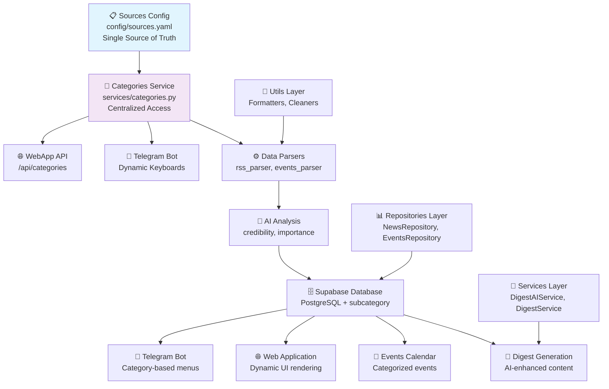
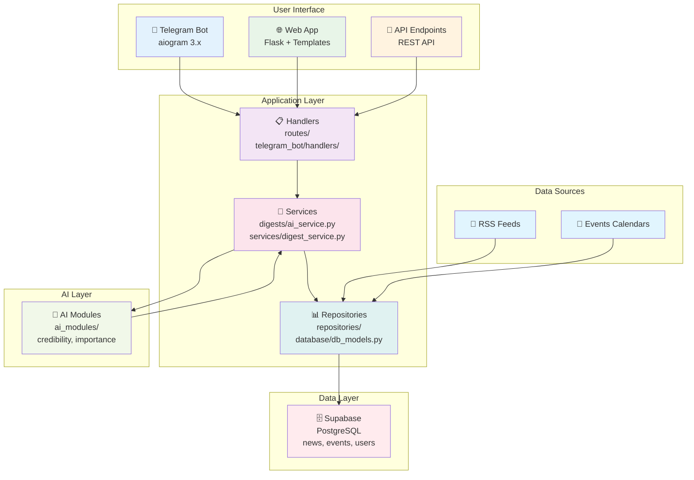

# PulseAI System Architecture

PulseAI is built as an ETL pipeline with AI analysis and output to different interfaces.

## Table of Contents

- [System Overview](#system-overview)
- [Architecture Diagram](#architecture-diagram)
- [Core Components](#core-components)
- [Data Flow](#data-flow)
- [Technology Stack](#technology-stack)
- [Database Schema](#database-schema)
- [API Design](#api-design)
- [Deployment Architecture](#deployment-architecture)
- [Subscriptions & Notifications](#subscriptions--notifications)

## System Overview

PulseAI transforms chaotic news and events streams into structured, AI-analyzed content delivered through multiple interfaces including web applications, Telegram bots, and APIs.

## Architecture Diagram



## Core Components

### Categories Management System
- **Single Source of Truth** — `config/sources.yaml` contains all categories, subcategories, and RSS sources
- **Centralized Service** — `services/categories.py` provides unified access to category data
- **Dynamic Integration** — All components (bot, WebApp, parsers) automatically use updated categories
- **Icon System** — Each subcategory has a unique icon key mapped to emoji for UI consistency

### Data Sources
- **RSS Feeds** — News from crypto, economy, world, tech categories (198+ sources)
- **Economic Calendars** — Investing.com events parsing
- **News Websites** — Direct scraping capabilities

### Data Processing Layer
- **Parsers** — Data extraction and cleaning modules
  - `parsers/rss_parser.py` — RSS feed processing
  - `parsers/events_parser.py` — Economic events parsing
  - `utils/clean_text.py` — HTML cleaning and text normalization
- **AI Modules** — Content analysis and scoring
  - `ai_modules/credibility.py` — News credibility assessment
  - `ai_modules/importance.py` — News importance scoring
  - `digests/ai_summary.py` — AI-powered digest generation

### Data Storage
- **Supabase (PostgreSQL)** — Primary database
  - `news` table — News articles with AI scores
  - `events` table — Economic events with priorities
  - `users` table — User management (future)
  - `subscriptions` table — User preferences (future)

### Business Logic Layer
- **Services** — Core business logic
  - `services/digest_service.py` — Digest generation
  - `services/digest_ai_service.py` — AI-powered digest service
- **Repositories** — Data access layer
  - `repositories/news_repository.py` — News data operations
  - `repositories/events_repository.py` — Events data operations

### Presentation Layer
- **Web Application** — Flask-based web interface
  - Templates for news, events, and digests
  - Responsive design with mobile support
- **Telegram Bot** — aiogram 3.x based bot
  - Inline navigation and commands
  - AI digest generation by categories
- **CLI Interface** — Command-line tools
  - `main.py` — Main CLI application
  - `tools/` — Utility scripts

## Data Flow Diagram

**Поток данных:**
Sources Config → Categories Service → Parsers/Bot/WebApp → AI Analysis → Database → User Interfaces

**Categories Integration:**
config/sources.yaml → services/categories.py → All Components (Dynamic Updates)



### Component Descriptions

- **Handlers**: файлы в `routes/`, обработчики команд Telegram (`telegram_bot/handlers/`)
- **Services**: бизнес-логика, например `digests/ai_service.py`, `services/digest_service.py`
- **Repositories**: работа с БД (модели, `database/db_models.py`, `repositories/`)
- **Supabase**: хранение новостей, пользователей, категорий
- **AI**: модули в `ai_modules/` для оценки важности и генерации дайджестов

## AI Digest UX

### Progress Animation
- **Immediate feedback**: Instant response to user actions
- **Animated progress**: Visual steps with progress bar
- **Real-time updates**: Live progress indication during generation

### User Experience Flow
1. **User request**: `/digest_ai` or category selection
2. **Immediate response**: "⏳ Генерация дайджеста для тебя..."
3. **Progress animation**: 5 animated steps with visual progress bar
4. **Final result**: Personalized digest with action buttons
5. **Action buttons**: Subscribe to category, enable auto-digest

### Technical Implementation
- **`utils/progress_animation.py`**: Core animation system
- **`ProgressAnimation` class**: Manages animated progress display
- **Async handling**: Non-blocking animation with `asyncio.create_task`
- **Error handling**: Graceful fallback for API errors

## Growth: Subscriptions & Notifications

### User Management
- **User registration**: Automatic creation via Telegram ID
- **Profile management**: Username, locale, preferences
- **UUID-based**: Scalable user identification system

### Subscription System
- **Category subscriptions**: Users can subscribe to news categories
- **Flexible management**: Add/remove subscriptions via bot commands
- **Database integration**: Persistent subscription storage

### Notification System
- **Daily digests**: Automated morning digest delivery
- **Custom scheduling**: User-configurable notification times
- **Frequency options**: Daily, weekly, instant notifications

## Technology Stack

### Backend
- **Python 3.11+** — Main programming language
- **Flask** — Web framework
- **Supabase** — Database and authentication
- **OpenAI API** — AI analysis and content generation
- **aiogram 3.x** — Telegram bot framework

### Data Processing
- **Requests** — HTTP client for data fetching
- **Feedparser** — RSS feed parsing
- **BeautifulSoup** — HTML parsing and cleaning
- **Pydantic** — Data validation and models

### Development Tools
- **Pytest** — Testing framework
- **Black** — Code formatting
- **Flake8** — Code linting
- **Mypy** — Type checking

## Database Schema

### News Table
```sql
CREATE TABLE news (
    uid TEXT PRIMARY KEY,           -- SHA256 hash of URL+title
    title TEXT NOT NULL,            -- News headline
    link TEXT,                      -- Source URL
    published_at TIMESTAMPTZ,      -- Publication time (UTC)
    content TEXT,                   -- News content
    credibility NUMERIC,            -- AI credibility score
    importance NUMERIC,             -- AI importance score
    source TEXT,                    -- Source name
    category TEXT,                  -- News category (crypto, sports, etc.)
    subcategory TEXT                -- News subcategory (bitcoin, football, etc.)
);
```

### Events Table
```sql
CREATE TABLE events (
    id UUID PRIMARY KEY,            -- Unique identifier
    title TEXT NOT NULL,            -- Event name
    country TEXT,                   -- Country code
    currency TEXT,                  -- Currency code
    category TEXT,                  -- Event category (markets, world, etc.)
    subcategory TEXT,               -- Event subcategory (stocks, conflicts, etc.)
    importance INTEGER,             -- Priority (1-3)
    event_time TIMESTAMPTZ,         -- Event time (UTC)
    fact TEXT,                      -- Actual value
    forecast TEXT,                  -- Forecast value
    previous TEXT,                  -- Previous value
    source TEXT                     -- Source name
);
```

## API Design

### REST Endpoints
- `GET /api/news` — Retrieve news articles
- `GET /api/events` — Retrieve events
- `GET /api/categories` — Get full category structure with icons
- `GET /api/categories/validate` — Validate sources.yaml structure
- `POST /api/digest` — Generate digest
- `GET /api/digest/{id}` — Get specific digest

### Query Parameters
- `limit` — Number of items to return
- `category` — Filter by category
- `date_from` — Start date filter
- `date_to` — End date filter

## Deployment Architecture

### Development Environment
- Local Python virtual environment
- Supabase development database
- Local file-based logging

### Production Environment
- **Render** — Application hosting
- **Supabase** — Production database
- **GitHub Actions** — CI/CD pipeline
- **Telegram Bot** — Deployed bot instance

### Monitoring
- Application logs via Python logging
- Database monitoring via Supabase
- Error tracking and alerting
- Performance metrics collection

## Security Considerations

- API rate limiting
- Input validation and sanitization
- Secure environment variable management
- Database access controls
- HTTPS enforcement

## Scalability Considerations

- Horizontal scaling via load balancers
- Database connection pooling
- Caching strategies for frequently accessed data
- Asynchronous processing for AI operations
- CDN for web assets

## Subscriptions & Notifications

### Overview

The subscription and notification system allows users to personalize their news consumption by subscribing to specific categories and configuring notification preferences. The system supports both manual subscription management through Telegram commands and automated digest delivery.

**Flow:** Telegram → Handlers → Services (Subscriptions/Notifications) → Repositories → Supabase

### Architecture Components

- **Handlers**: `routes/subscriptions.py` - Telegram bot command handlers
- **Services**: `services/subscription_service.py`, `services/notification_service.py` - Business logic layer
- **Repositories**: `database/db_models.py` - Data access layer
- **Database**: Supabase/PostgreSQL with dedicated tables for users, subscriptions, and notifications

### Subscription Management Flow

```mermaid
flowchart TD
    TG[Telegram Bot] --> H[Handlers]
    H --> S1[SubscriptionService]
    H --> S2[NotificationService]
    S1 --> DB[(Supabase/Postgres)]
    S2 --> DB
    S2 -->|Cron| TG
    
    subgraph "Telegram Commands"
        C1[/subscribe category]
        C2[/unsubscribe category]
        C3[/my_subs]
        C4[/categories]
    end
    
    subgraph "Database Tables"
        T1[users]
        T2[subscriptions]
        T3[notifications]
    end
    
    C1 --> H
    C2 --> H
    C3 --> H
    C4 --> H
    
    S1 --> T1
    S1 --> T2
    S2 --> T1
    S2 --> T3
    
    style TG fill:#e3f2fd
    style H fill:#f3e5f5
    style S1 fill:#fce4ec
    style S2 fill:#fce4ec
    style DB fill:#ffebee
```

### Key Features

#### User Management
- Automatic user creation on first interaction
- Telegram ID mapping to internal user records
- User preferences (locale, username) storage

#### Subscription System
- Category-based subscriptions (crypto, economy, world, technology, politics)
- One subscription per category per user (UNIQUE constraint)
- Easy subscribe/unsubscribe via Telegram commands

#### Notification Preferences
- Multiple notification types: `digest`, `events`, `breaking`
- Frequency options: `daily`, `weekly`, `instant`
- Timezone-aware delivery (Europe/Warsaw)
- Per-user preferred delivery hours

#### Automated Digest Delivery
- Cron-based scheduling via `tools/send_daily_digests.py`
- Personalized content based on user subscriptions
- AI-powered digest generation
- Batch processing with error handling

### Database Schema

#### Users Table
```sql
CREATE TABLE users (
  id BIGSERIAL PRIMARY KEY,
  telegram_id BIGINT UNIQUE NOT NULL,
  username TEXT,
  locale TEXT DEFAULT 'ru',
  created_at TIMESTAMPTZ DEFAULT now(),
  updated_at TIMESTAMPTZ DEFAULT now()
);
```

#### Subscriptions Table
```sql
CREATE TABLE subscriptions (
  id BIGSERIAL PRIMARY KEY,
  user_id BIGINT REFERENCES users(id) ON DELETE CASCADE,
  category TEXT NOT NULL,
  created_at TIMESTAMPTZ DEFAULT now(),
  UNIQUE(user_id, category)
);
```

#### Notifications Table
```sql
CREATE TABLE notifications (
  id BIGSERIAL PRIMARY KEY,
  user_id BIGINT REFERENCES users(id) ON DELETE CASCADE,
  type TEXT NOT NULL CHECK (type IN ('digest','events','breaking')),
  frequency TEXT NOT NULL DEFAULT 'daily' CHECK (frequency IN ('daily','weekly','instant')),
  preferred_hour SMALLINT DEFAULT 9 CHECK (preferred_hour BETWEEN 0 AND 23),
  enabled BOOLEAN DEFAULT TRUE,
  created_at TIMESTAMPTZ DEFAULT now(),
  UNIQUE(user_id, type)
);
```

### Integration Points

- **Telegram Bot**: Command handlers for user interaction
- **Digest Service**: Generates personalized content based on subscriptions
- **Scheduler**: Cron jobs for automated delivery
- **AI Service**: Powers intelligent digest generation